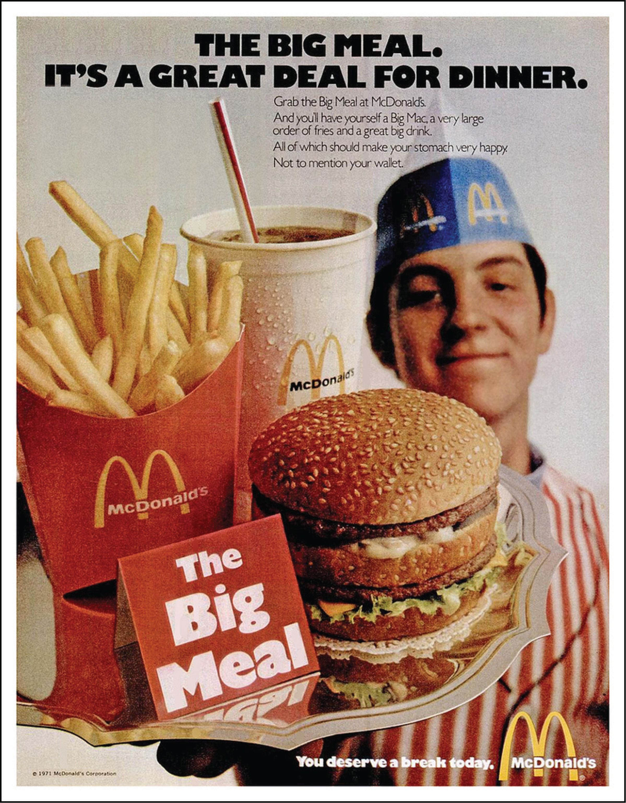
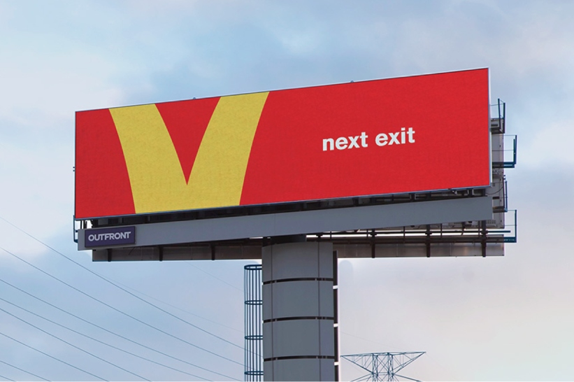
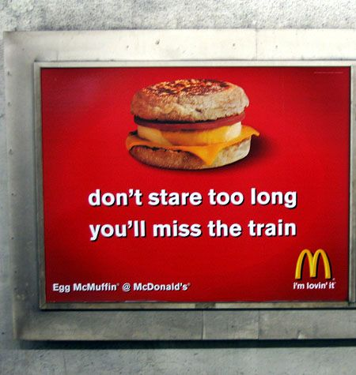

When considering the advertisements that us as consumers are consistently surrounded by, the marketing strategies of fast-food chains and restaurants stand out from the crowd. Whether it’s through social media, television or bus stop build boards, we are saturated by various typographical constructions which have been successfully promoting the cheap and cheerful food for generations.

McDonalds is one of the most prominent and popular fast-food chains and first opened its doors in the UK in 1974, and since then its advertisements have completely transformed. When looking at the advertisement below, created in the 1970’s, and comparing it the much newer billboard in 2021, it is evident that there has been a typographical shift in McDonald’s marketing technique. However, it is also important to recognise the similarities between the two advertisements which as a result have created a sense of familiarity to customers. For instance, the high weighted and low contrast bold Sans Serif font for the main headlines of the text remains a consistent feature, such as when comparing “you deserve a break today” and “The Big Meal” to the more contemporary slogan “I’m loving it”. As well this, the white text on the red backgrounds has also remained a constant which ultimately would have had an influential effect on consumers as it has increased the familiarity of the brand. For instance, a McDonalds customer can see these typographical features anywhere in the world and know what they are getting.

On the other hand, there are numerous differences as the brand has evolved over time. As time has progressed, the typographical techniques used have begun to connote more of a sense of arrogance. In the advertisement from the 1970’s, a much higher amount of text is used and the typography itself is more condensed; it is as though the advertisers are trying to fit as much information as possible into the poster in order to really sell the product. Also, the recognisable McDonald’s logo of the yellow ‘M’ (or “the Golden Arches) is used numerous times in one advertisement, possibly to engrave it in the consumers mind. This some-what prestigious and stylised logo introduced in 1968 directly juxtaposes to the simple and basic font used in the rest of text, this could as a result indicate the fact that despite being high-quality food it is still accessible to everybody.

 When comparing this to newer advertisements, it is clear that McDonalds are now less concerned about promoting their food, as they have become aware of the power of brand recognition as their popularity has grown. In many of the more contemporary advertising examples shown below, the logo is often featured subtly at the bottom, or even not at all, and very little text is used. Instead, the brand relies on the recognisability of the white serif sans typography on the red background to advertise. The sense of arrogance or confidence in their brand is also shown by the small size of the font compared to the potential space it could fill, the fact that it is written in lower case and that it lacks punctuation; almost to indicate that due to their popularity they don’t need to follow rules or try hard at all to sell their product.

The recognisability of the brands familiar typography is particularly noticeable when looking at the "this is McDonald's" advertising campaign, launched in 2020, in which they depicted their menu in a typographic form and cleverly used font to create imagery of their food without an actual picture:

This emphasises the brands familiarity and the fact that it does not feel the need to stick to the norm as it did not include a logo nor the red, yellow and white theme that consumers are used to. Nevertheless, the use of the bold san serif font and simplicity of the design was familiar enough to consumers to know who the advertiser is, which only further reiterates the power that typography within their advertisements has had on the brands success overall. 

In part two of the exploration of the typography used by fast food chains, we will look at how other familiar brands compare to McDonalds and how they make themselves stand out in the saturated market.