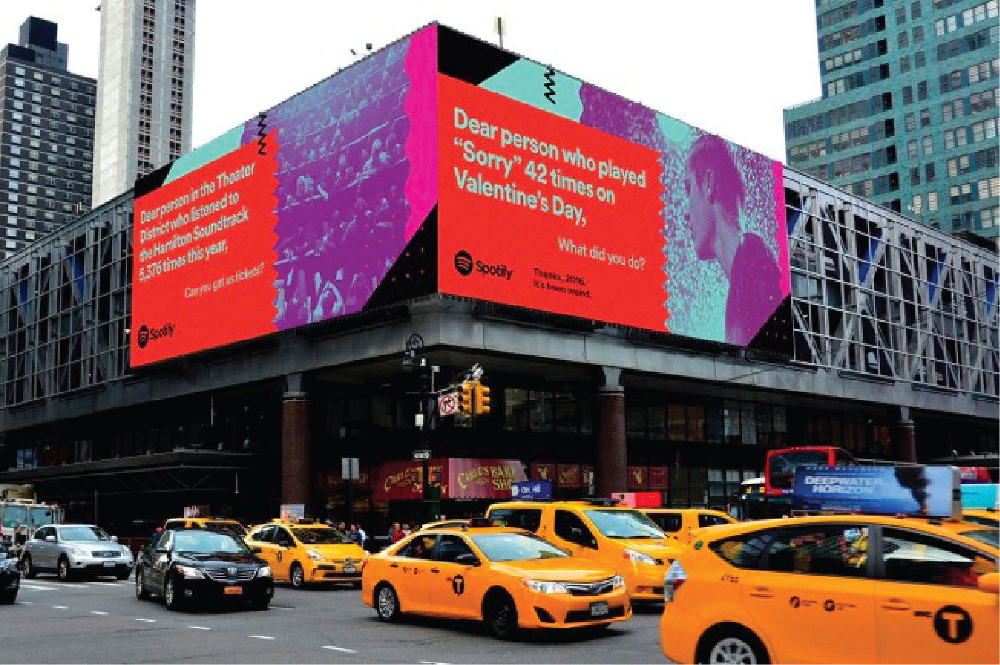
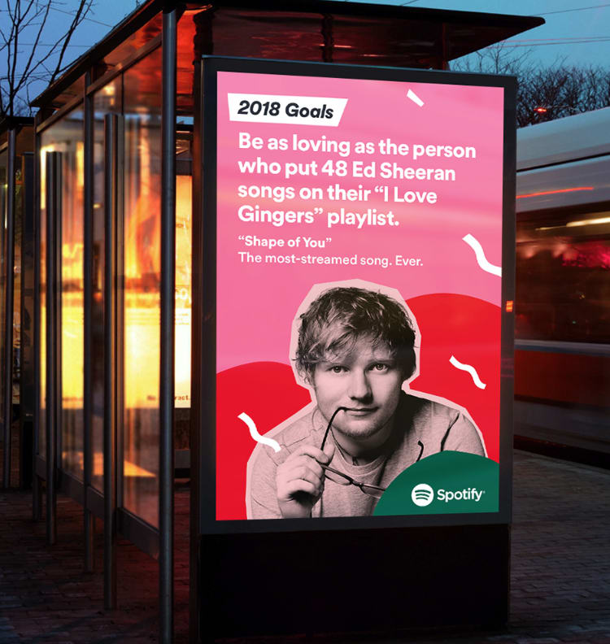
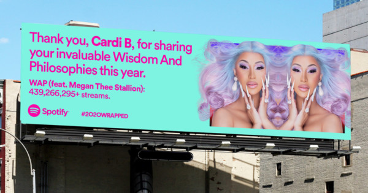
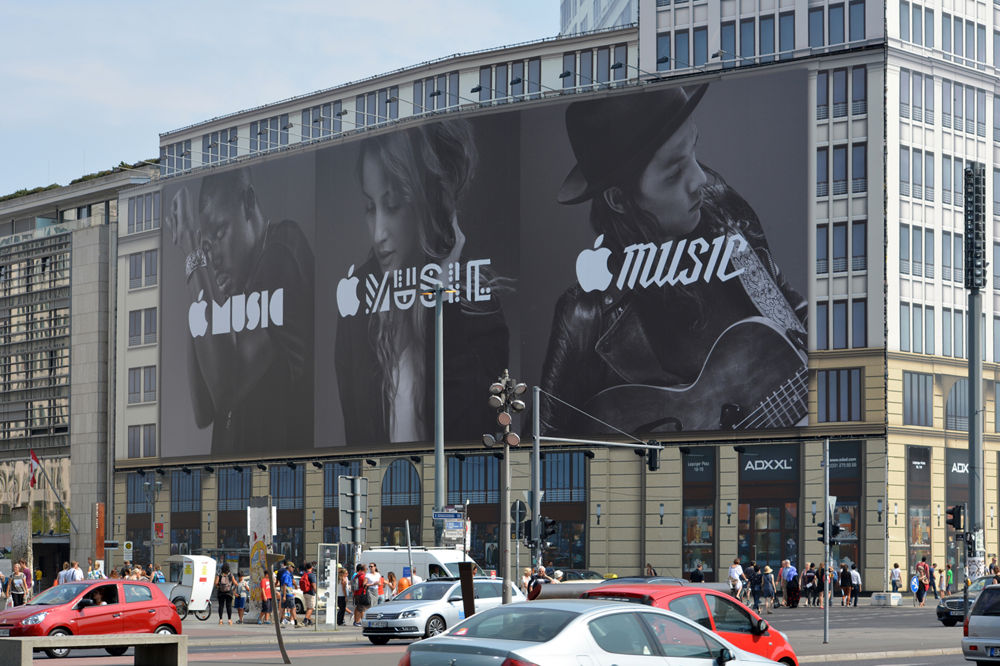
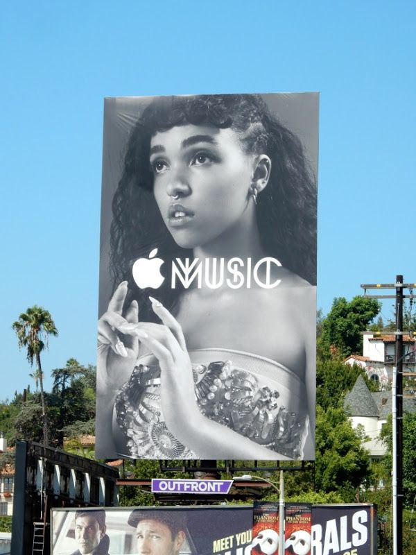
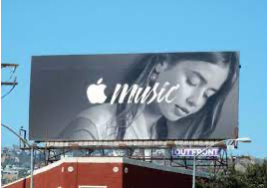
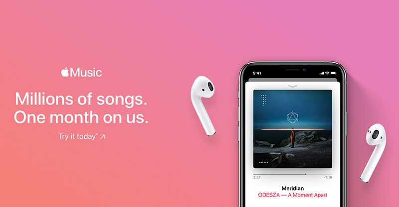

Keys, wallet, phone, earphones? In today’s contemporary society the majority of us are frequently using a music streaming service of some description. Although there are a variety of platforms available, the most commonly used in 2020 were *Spotify*, launched in 2006, with **165 million** subscribers and *Apple Music*, launched in 2015, with an estimated **78 million** listeners. As a result, this only continues the debate of which is the better music service, therefore it seems fitting to compare the typography used in the advertising across the two platforms and discover who is doing a better job at attracting consumers.

 When firstly exploring the typography used by *Spotify*, it is clear that their advertisements are eye-catching and engaging for consumers. Despite playing around with differing bright colours, a sans serif and heavy weighed font with low contrast is consistently used. This is clear and easy for consumers to read and understand, and it appears casual and fun, as a result this could be seen to reflect the brand itself which promotes itself as an easy-to-use service which is accessible for everybody. By sticking with the same font and including their well-known logo on the advertisement, the brand increases its recognisability and familiarity. The fact that the text appears on a bright and bold backgrounds also connotes a sense of enthusiasm and urgency which is appealing and makes you want to listen to the songs. The brand also focuses more on the actual music and artists streamed rather the app itself, which reiterates the casual and light-hearted feel of the advertisement as it is connecting with consumers and what they listen to. The use of the pink typeface in the advertisement featuring **Cardi B** and her widely streamed song WAP is particularly effective as the use of the bold font for certain words, such as her name and the song, makes it stand out to fans of that particular artist who are known as being particularly feminine and bold in the sense of female empowerment. As a result, the typography reflects the audience well.

When comparing this to the typography used by *Apple Music* there are many clear differences. One of the most prominent differences is the font used, while *Spotify* stuck to the same easy-to-read font, *Apple Music* uses a variety of creative, unique and modern fonts, many of which would be described as a novelty type in which they are playful, artistic and do not stick to any rules. This clearly reflects the platform as one with a variety of genres of music in which there is something for everyone. The use of monotone colours is eye catching and gives of a high-end and prestigious effect. It almost appears more mature and prestigious than the juvenile colourful *Spotify* adverts. As well as this, featuring the Apple logo creates that sense of brand recognition to consumers, and so for many the music platform would seem reliable and trustworthy, demonstrating the power of brand recognisability.

However, while the style and typography of the *Spotify* advertisements remain consistent across the majority of their marketing, *Apple Music* also have adverts which are less artistic and novelty and instead very similar to the style of *Spotify*. Despite being more regular weighted, the sans serif low contrast font presented upon a boldly coloured gradient background is also visible across many *Apple Music* digital advertisements. Nevertheless, despite a similar font, these advertisements still remain a lot more subtle with much more simplicity than *Spotify*, perhaps to still achieve more of a sense of maturity and trustworthiness. Although still including images of artists and their music, it is in a way that interacts less with the audience.

To conclude, despite offering a very similar service, both platforms advertise in different ways and while in some cases the typography appears to be similar, it has a different affect overall as though they are each trying to reach different audience demographics.