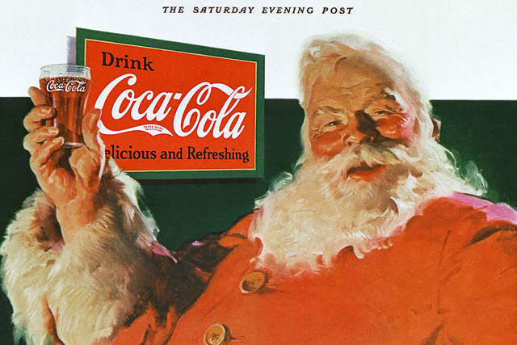
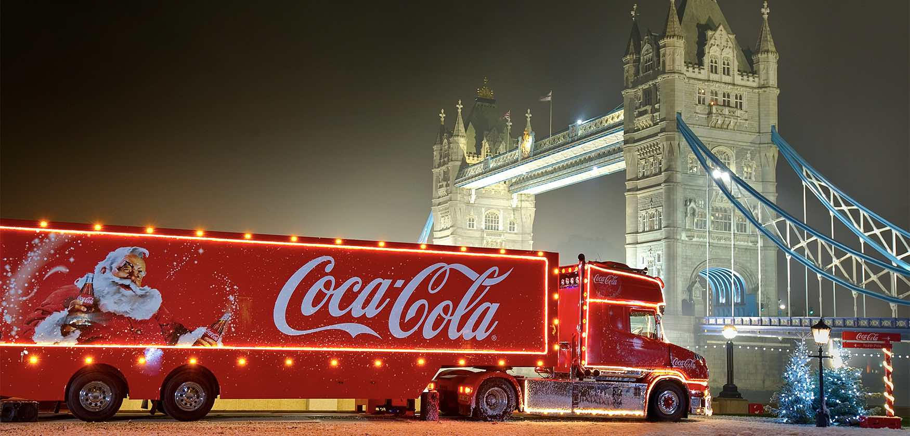
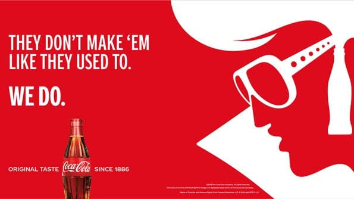
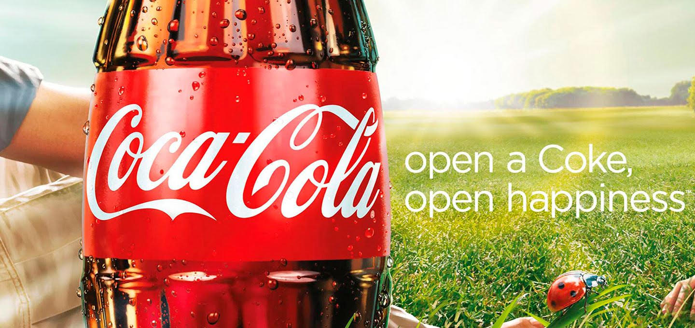
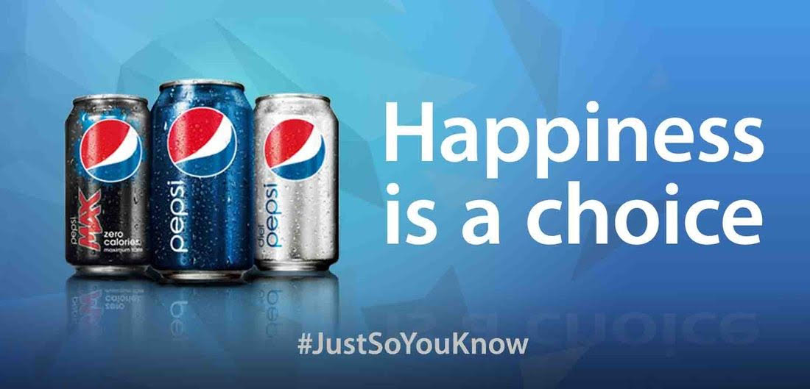
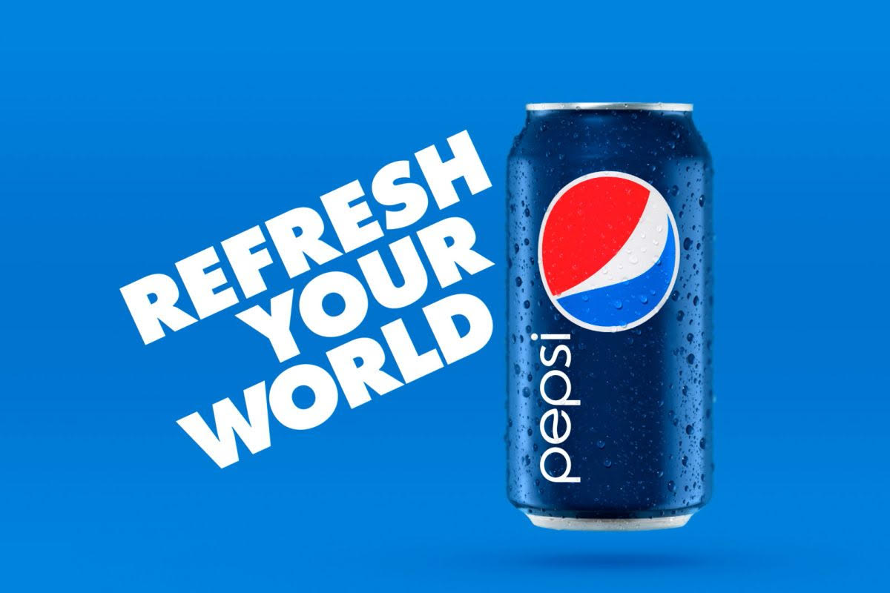
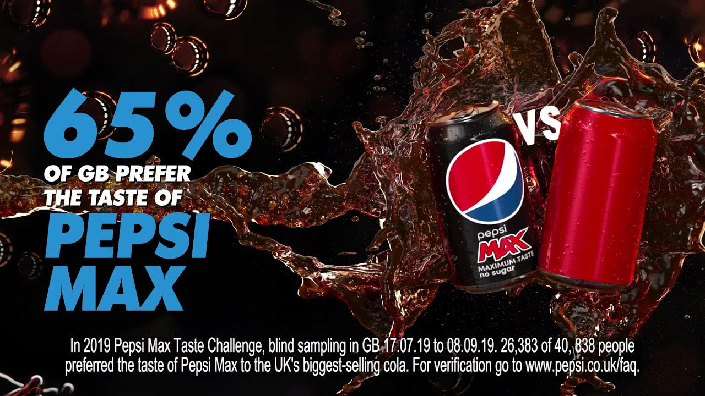
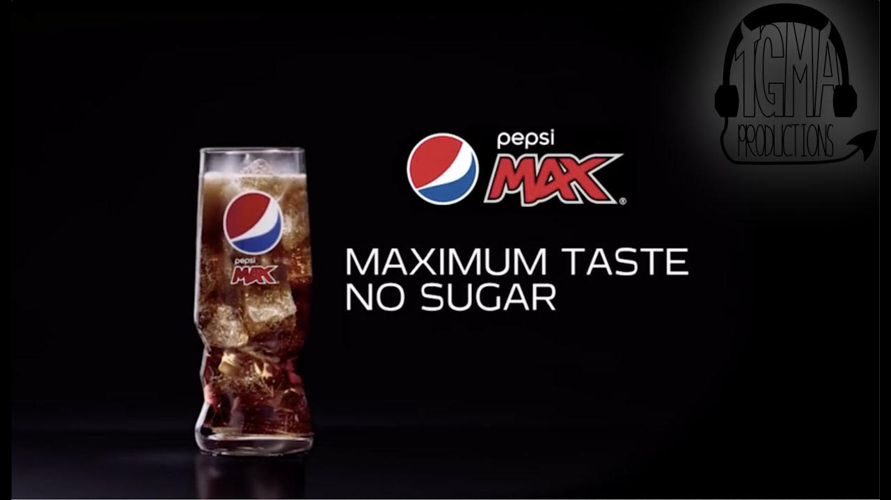

Cola-cola or Pepsi is an age-old debate dating back generations, both are large mainstream brands offering the same product. Whether it’s asking for one in a restaurant, and they only have the alternative, or having a clear favourite over the two the point you despise the other; everyone has a preference at least to some extent. Due to how similar the products are, both brands have had to ensure that their marketing and advertising differs entirely from their competitor, to make themselves stand out and known.

 

Starting with Coca-Cola, a globally known company which has time on its side, due being founded in 1886, as a comparison to Pepsi in 1965. Coca-Cola has become known for its advertisements, whether it’s through the red and white colour theme displaying the well-known logo as large as possible, or the classic image on Santa Clause sipping on his coke at Christmas time. One extremely effective technique that the brand has stuck to is consistency, due to how similar each advertisement is, the brand is easily recognisable to most people. Typographically, when looking at the logo which is typically white and large in size, the cursive unique and creative font creates a sense of elegance and gives a high quality, classic feel which has become comfortable to consumers. This notion of class and trustworthiness is further reiterated by the use of Father Christmas throughout all of their Christmas campaigns, by which Santa appears in what many now would consider a more vintage, old-fashioned look as many of more modern concepts of the Christmassy character can be drastically different, this again creates that sense of familiarity and nostalgia for consumers. 

This classic feel is also demonstrated outside of the festive season, as shown below. In both of these advertisements a simplistic white sans serif font is used and apart from the “we do” which is in bold, the rest of the typography is of low weight and contrast. This directly juxtaposes the more prestigious logo font type. Effectively, due to the simplicity, it comes across almost calming, particularly in the second advertisement where the only capitalisation which is used is for the brand name. Whereas in the first advertisement it all entirely capitalised and uses colloquial spoken language features like “’em” instead of them; again, this is light-hearted to consumers and makes the brand appear approachable and not too high end meanwhile maintaining that classic feel. The classic effect shown at Christmas is also presented here with the Elvis-like imagery, as well as the written confirmation that it’s the same original taste that the brand has always had.

When comparing this to Pepsi, the main obvious difference is the colour scheme used. The blue tones directly contrast the red within Coca-Cola’s branding, possibly to demonstrate the two opposing forces. Another key difference is the typography used within the Pepsi logo, rather than cursive and classic, the Pepsi logo is a much more simplistic sans serif font with low weight and contrast, interestingly the brand name isn’t capitalised, and the cap height of each character remains consistent. This gives of a relaxed and simplistic effect by which nothing has been over complicated. However, the majority of Pepsi advertising, as shown below, does include some form of slogan and phrase to tell the product. The effect this has is extremely similar to Coca-Cola due to the typography used and what is actually said. Similar to Coca-Cola, some advertisements are entirely capitalised while others aren’t, but the white sans serif font remains a constant.

On the other hand, it is important to recognise the more recent advertising techniques of the brand, particularly when considering Pepsi-Max. In recent years, the majority of Pepsi marketing has been focused onto Pepsi-Max rather than the original sugary cola which they still offer. Pepsi-Max is an incredibly popular sugar free alternative that many favour, and it appears to have an entirely different advertising strategy typographically.

 In the first advertisement for Pepsi-Max shown above, there is an attempt to directly state that it is better than Coca-Cola, by using their own marketing techniques against them. By simply including a red drinks can, consumers straight away know which brand is being alluded to without Pepsi Directly mentioning it. The use of the blue sans serif bold font and some elements of the original Pepsi Logo shows customers that it is still the same trustworthy brand. The use of a statistic also reiterates the fact that the new product can be trusted. Furthermore, the now black background makes the product stand out from the crowd and presents it an entirely new drink; the use of black rather than a bold colour adds a sense of maturity and class that the original advertising was lacking. The new logo and change in typography for the new slogan (as seen in the second image) is much more creative and unique, now using more novelty fonts which will become recognisable to the brand meanwhile maintaining the overall simplistic nature which is easy to read and understand.

To conclude, while overall the products themselves remain similar, since the use of independent advertising for Pepsi-Max, the brands themselves now clearly differ. Coca-Cola is able to maintain the classic elegant feel, which is familiar to customers, and while Pepsi’s original advertising was still some-what effective, the new style and originality makes it stand out as its own brand. Nevertheless, the same question remains, which do you prefer?