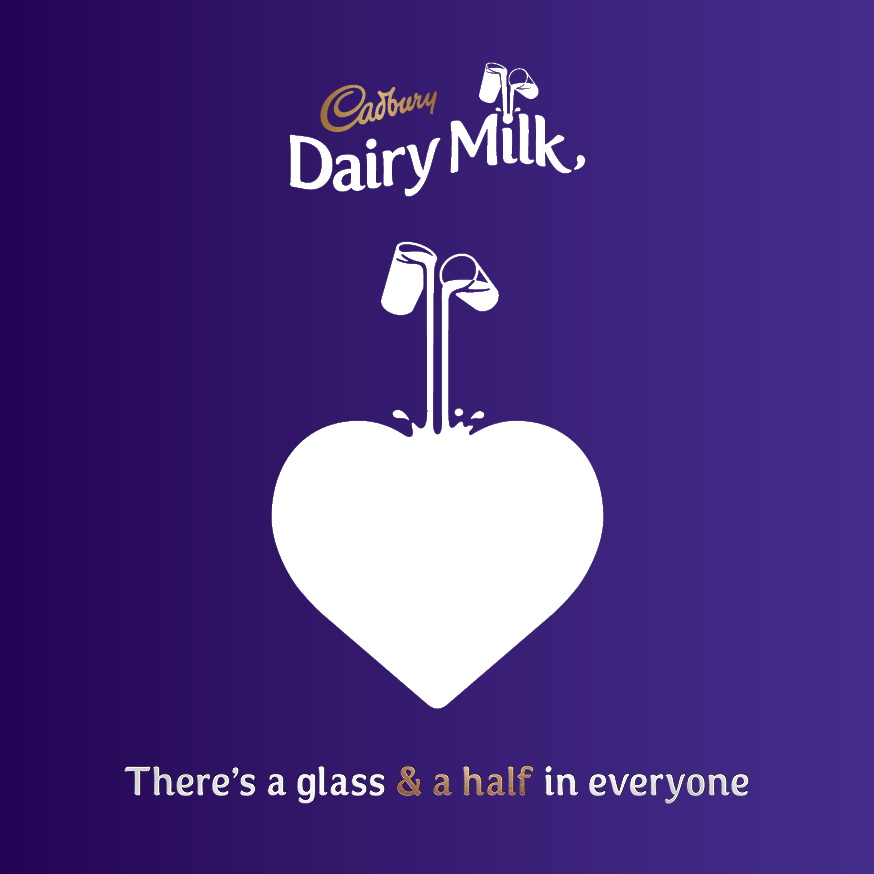

There are countless brands on the shelf in the confectionary isle making it difficult for us chocoholics to make a decision. As a result, chocolate brands need to stand out from the crowd when it comes to their advertising; so that us as consumers already know which sweet treat we fancy before even entering the store.

 Cadburys is one of the most prominent and most well-known brands when it comes to chocolate, Dairy Milk advertisements, in particular, are ones that we are all familiar with. Their iconic deep purple background is featured within almost all of the brand’s marketing and has become increasingly recognisable over the years, so much so that consumers would not need to see the brand’s logo to know what they are promoting. The majority of the adverts, as shown below, feature creative imagery of two glasses of milk being poured onto the text. The typography used is an original novelty font which almost looks cursive but in an animated, more visually appealing way. As a result, it almost appears that the text is flowing much like the glass and a half of milk. The decorative font is of quite high weighting and has a high contrast which in some ways makes it appear slightly more prestigious; the fact that the cap height varies letter to letter adds to the way it appears free flowing and natural. This typography is appealing to the consumer as it is creative yet not over complicated; the brand presents itself in an enjoyable and relaxed way which has a persuasive effect as it appears approachable in the fact that the product seems fun and creative but equally not over complicated as the main ingredient advertised is milk. 

The more contemporary Dairy Milk advertisement below, shows the milk being poured into a heart accompanied by the now well-known slogan “there’s a glass and a half in everyone”; this has a heart-warming and wholesome effect as it shows the care that has gone into the product. The typography used in this advertisement differs from the ones mentioned previously as this one uses a simple sans serif font which is more regularly weighted with a lower contrast. As a result, it effectively reiterates the simplicity behind the product as the design is not over complicated yet gets the message across well. This advertisement also features the logo more prominently and uses the same gold colour for some of the text within the slogan (“& a half”) that is used for the Cadburys logo. This reiterates the power of brand recognition as they know that their brand is trustworthy and well known so this is a selling factor by itself, the gold colour also adds to the level of prestige and high-quality nature of the product.

Cadburys isn’t the only brand taking steps to influence consumers through marketing strategies. Another company with prominent advertising is KitKat with their well-known slogan “Have a break, have a KitKat.” As shown below this usually appears on a red background to the match the red featured within the logo. Red is quite commonly used by brands within advertising as it psychologically creates a sense of emergency for consumers and encourages them to get the product. Similar to the newer Cadburys advertisement, KitKat also uses a simple white sans serif font with a low contrast. However, in this advert it is a lot more impactful as the text itself is larger and bolder with a heavier weight. As a result, it stands out on the red background and adds to that sense of urgency which persuades the consumer, this impact is reiterated by the full stop which creates a sense of power as though to say that this is the answer to your problems and what you have been looking for. This is again shown through the simplicity of the advertisement as in it is not overcomplicated and that consumers should simply just have a KitKat.

An additional brand which creates an impactful sense of power within their chocolate marketing is Mars who, even in comparison to KitKat and Dairy Milk, keeps the advertising overly simple. As shown below, the sense of power is created by all caps sans serif font in a golden colour on the black background. The dark background foregrounds the simplistic gold typography “winning”, which implies that it is the best chocolate bar and as though it is elite and cannot be beaten. This sense of arrogance by the brand when presenting the power behind their product is supported by this hand raising the chocolate bar as though it has actually just won an award. The smaller white text of “work rest play” also highlights the simplicity of the advertising as though the brand does not feel it needs heavy marketing to encourage customers as the chocolate itself is the influencing factor.

 To conclude, while all the designs present a level of simplicity, the colours used as backgrounds directly contrast from one another to make the brand stand out. Cadburys appears to have the most recognisable advertising techniques in a way that is subtle and convincing to consumers as a comparison to KitKat and Mars which uses more impactful techniques within their typography.