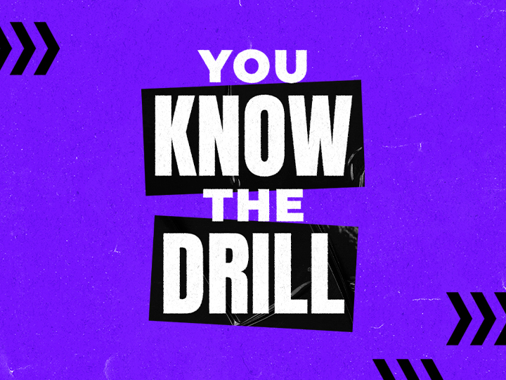
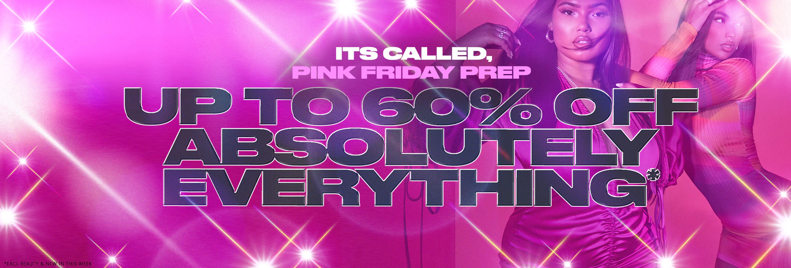
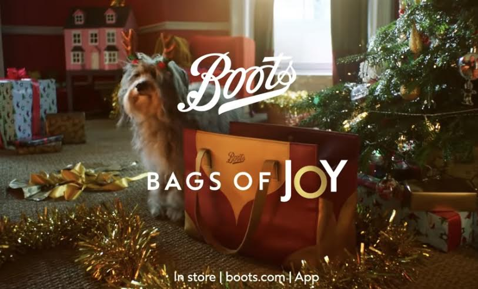
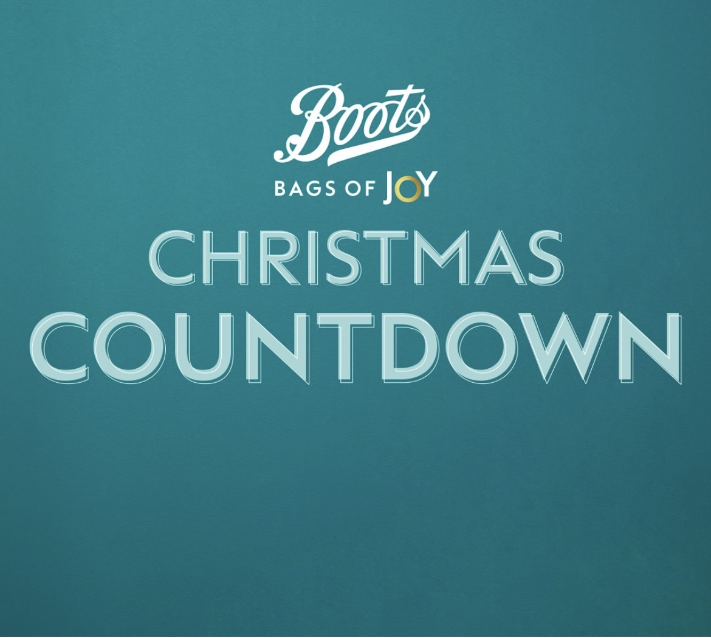

The festive season is fast approaching once again, meaning that it the perfect opportunity for brands to thrive when it comes to their advertising in order to increase sales. Both Black Friday and Christmas sales are reliant on effective marketing, so that consumers know where they can get the best deals.

Popular brands such as Gymshark and Pretty Little Thing have become well known for their annual Black Friday Sales. When exploring the advertisements these two prominent brands have used for this year, as shown below, it is clear that they are aware of the power behind brand recognition; due to being well known companies, they have used their success from previous years to drive their campaign for this year.

Both brands use bright and bold background colours to grab attention, they also both use all capital blocked sans serif fonts which is heavy weighted and of low contras. The typography on both is also quite condensed with the same high cap height throughout. This is an effective technique for both brands as it draws the eye to what the text is saying rather than what is going on in the background.

 Gymshark benefit from the power of brand recognition, this is obvious as they do not feature any logo or hint towards what brands advertising it actually is, it relies on the style usually used within the advertising and the slogan “you know the drill” which instantly tells us which brand it is due to how big their black Friday sales are every year. By referring to the sales as a “drill”, a sense of urgency is also implied which encourages the advertisement to stick in the consumer’s mind. Comparatively, Pretty Little Thing have also used the popularity of the brand to make the advertisement stand out, by remarketing Black Friday as “Pink Friday” which is more suited to their company and having an early sale leading up to the main one, more attraction is drawn to the website and consumers don’t want to miss out. By having the typography for “it’s called Pink Friday prep” smaller in font size than the rest of the text means that attention is drawn to the current sale but still reminding customers of the Black Friday Event.

 Other brands which are particularly prominent around the festive season are one such as John Lewis and Boots, which promote themselves towards the notion of Christmas gift giving. John Lewis in particular has become well known for its television advertisements which are often emotive and tell a story; the wholesome nature tends to appear heavily to consumers. Boots also bring in more customers around Christmas time due to the sales and promotions they have on gift sets which appeal to a widely varied audience, by which they have something for everybody. However, both brands use typography within their advertising in different ways, as evidenced below.

While both companies use block capital sans serif font at a low contrast, John Lewis use typography in a much more subtle way. The text is of a low font size compared to the potential space it could fill, it is also lower weighted and allows the picturesque background to still be noticed which displays the wholesome Christmassy landscape used throughout the video advertisements. It appeals more to the consumer directly and is more focused on selling the Christmas experience rather than the products that the brands actually offer.

 On the other hand, Boots feature its logo within the Christmas advertisements (which John Lewis doesn’t, and the typography is of a larger font size, which puts the consumers attention onto the actual brand. The typography used for “Joy” within both the advertisements uses a different typographical technique in comparison to the rest of the text used. The font size is slightly larger, and the text is bolder, as well as this the cap height of the “O” is lower than the other characters and also differs in colour. The gold colour used adds to the festive feel, it almost imitates a Christmas reef; gold also connotes a sense of prestige and high quality which could reflect the products offered. This is also reflected by the cursive font used within the Boots logo which also reflects this high-quality feel that consumers want around Christmas time. Displaying the logo is also effective as consumers are away that Boots is a well-known and trusted brand.

 Ultimately, while each of these brands promote themselves differently from one another, they all use how recognisable they are to effectively advertise around the holidays, whether that’s for Black Friday or Christmas, and therefore are able to benefit this time of year as consumerism rises as a result of gift giving.