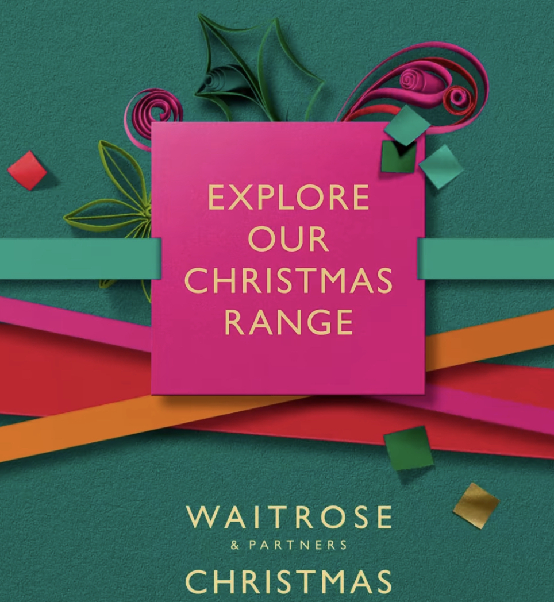
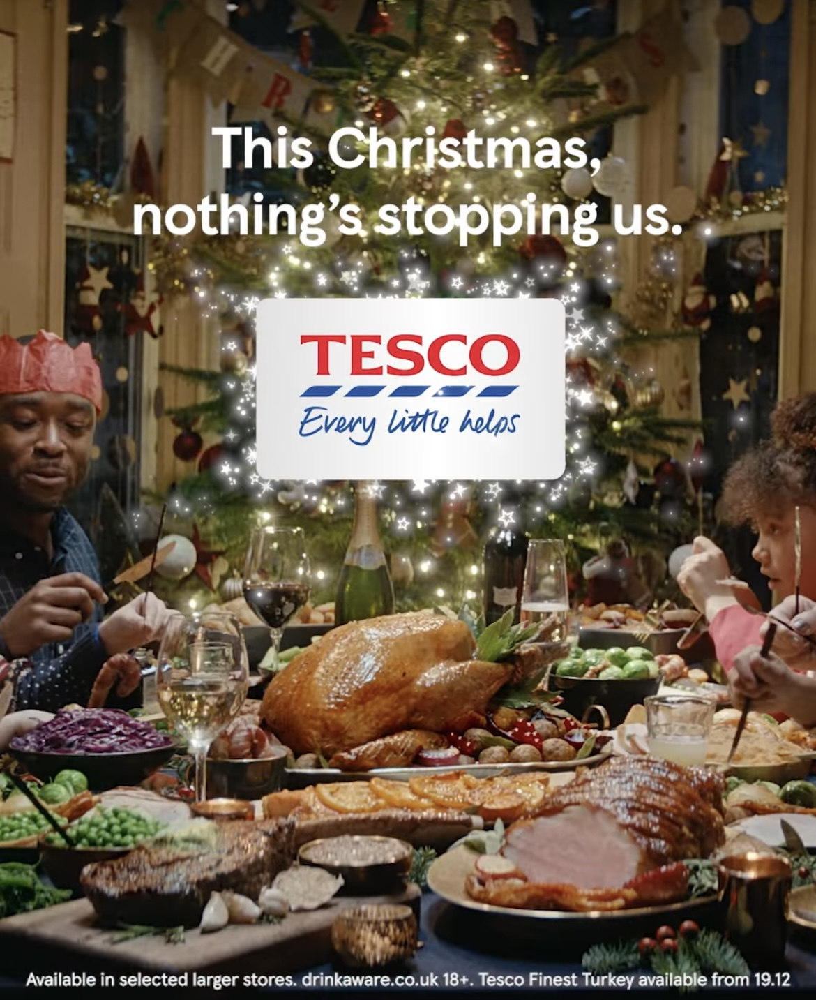

As mentioned previously, the festive season is the perfect time of year for brands to battle it out with their competitors for the attention of consumers up and down the country. Supermarkets are no exception to the rule. Throughout the entire year supermarkets advertise their newest products and latest deals in order to keep up with their competition, however, around Christmas time their adverts all tend to change and become more prominent in the media in order to encourage customers to shop with them for their festive feasts.

One supermarket that stands out for their advertising this year is *Waitrose*. As shown below, the company uses bright and bold colours to make the marketing stand out to consumers. The differing colours and shapes, some of which appear to be cut out of paper, seem to depict a present and give off that Christmassy and festive vibe that we all love this time of year. These bright colours which appear fun and playful directly contrast against the quite sophisticated typography used. The gold lettering in the simple and not over complicated sans serif font which is quite low weighted with a low contrast with thin lettering, reflects the brand well. This is due to the fact that *Waitrose* as a brand is viewed by consumers as high quality and quite high end, the typography used comes across as simple but effective and sophisticated, as though they do not need to over complicate their advertising as their customers know the quality can be trusted and the brand is already respected. This is also shown by the fact that the font used is the same as the font used within the logo all year round, this is effective as it uses the brands recognisability to appeal to customers; however, having the type face in the prestigious gold colour as opposed to the dark green colour typically used gives of the festive feel to fit the time of the year better.

In comparison, when looking at the *Tesco* Christmas advertisement for this year, as shown below, the overall effect differs from *Waitrose*. When looking at the background image, it gives of a wholesome feel by depicting a family gathered around a table for Christmas, therefore creating a sense of familiarity for the consumer, in the sense that it is heart-warming and makes us excited for the festive season. A similar effect is created by the text: “This Christmas, nothing is stopping us”, as the consumer can relate to this as the majority of the UK did not enjoy Christmas to its full potential last year due to the COVID lockdown’s. The simple sans serif font in white with regular weighting and low contrast is effective as it is direct and not over complicated; it is something we can easily understand and agree with. It also reflects *Tesco* as a brand, as the supermarket chain is very well known and a lot more financially accessible to everyone than *Waitrose* is. Overall, the advert is not overcomplicated and simply reminds us that what is important as Christmas is spending time with family. The typography is also of a regular font size and is condensed, as well as this, the well-known and recognisable logo is featured just below the text in a simple white box to make it stand out; the spacing of the these features in this advert is effective as it does not draw attention away from the background, it keeps the focus on the products and the festivities meanwhile using their brands recognisability to appeal to consumers who trust the company. 

 Another prominent Supermarket we are all familiar to is *Asda*, this year their Christmas advert stands out from the others as it is a lot bolder and more eye-catching than the simplicity of the other two. While the typography used is still a sans serif font with low contrast, the font is of a heavier weight and takes up more space, in general it appears bolder in comparison. In this advert, the festive feel is created by the loud typography and the fact that it has been made to look glittery and sparkly, this gives almost a luxury feel to a brand which we all recognise as one that is accessible. The silver colouring of the typography directly contrasts to the gold colouring of the ice skate in order to effectively make both elements stand out. Similarly, keeping the *Asda* logo in green makes it stand out against the background. As a result of these components, despite being the loudest advert in terms of typography, the idea itself is probably most simple. This draws consumers in as it looks fun and exciting without being over complicated. Customers know what they are getting with *Asda* and so it seems as though the advert reflects this in a fun eye-catching way.

 All of the examples of the supermarket Christmas adverts are effective, as typography is used in a way that appeals to the consumers of each brand and reflects the companies. By which, the *Waitrose* advert appears more sophisticated and of high quality, the *Tesco* marketing reflects a heart-warming family feel of togetherness and the *Asda* advertisement gives of a fun festive feel of the sparkles and lights.