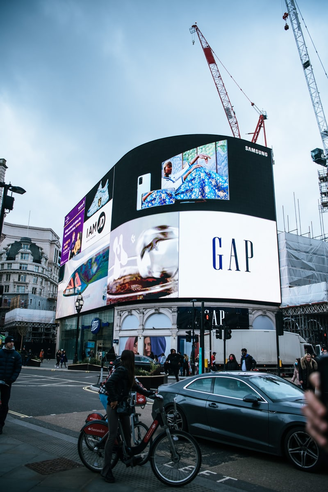

## ***What is Advertype?***

This website aims to explore the typography used within the advertising industry. It will look at how the use of typography by brands has evolved over time, how this compares to other advertisers and ultimately the effect this has on consumers.

## **Our Logo** 

Picture a “for sale” or “closing down…everything must go” sign in a shop window, or brand logos such as *KFC, Coca-Cola, Levis* and *Netflix;* what do they all have in common? 

The red and white colour theme with the bold typography, which is often found in a block capital sans serif font, is what has inspired many of the visual elements of this website. The bright colours and capitalisation are all prominent parts of enticing ads that we are all familiar with. So, it seemed fitting to replicate this effect when it comes to the logo. 

In terms of the banner imagery and other visual elements, it’s quite self explanatory. In the sense that it reflects the variety that this website brings when it comes to the type of advertising that is being explored. 

## **The brand**

This website looks at how effective our favourite brands' marketing is when it comes to the typography they use. Many of these brands (as you will discover) use bold and loud strategies. The Advertype brand wants to reflect this. 

As a whole, Advertype is meant to be bold and loud, nothing is off limits when it comes to exploring the advertising we see day in day out.

I aim to offer different opinions and different perspectives which might surprise you, so I also want to hear your view on the advertising that catches your eye!

So come along, and join me through the journey that is exploring typography in advertising...

